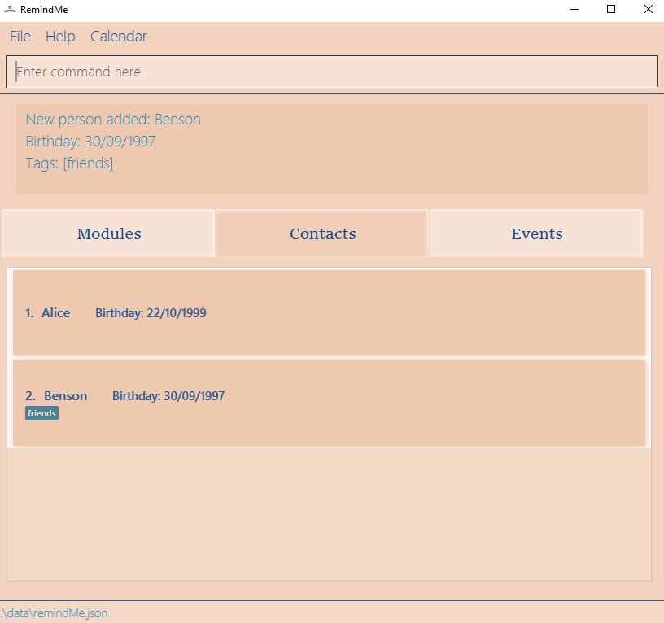
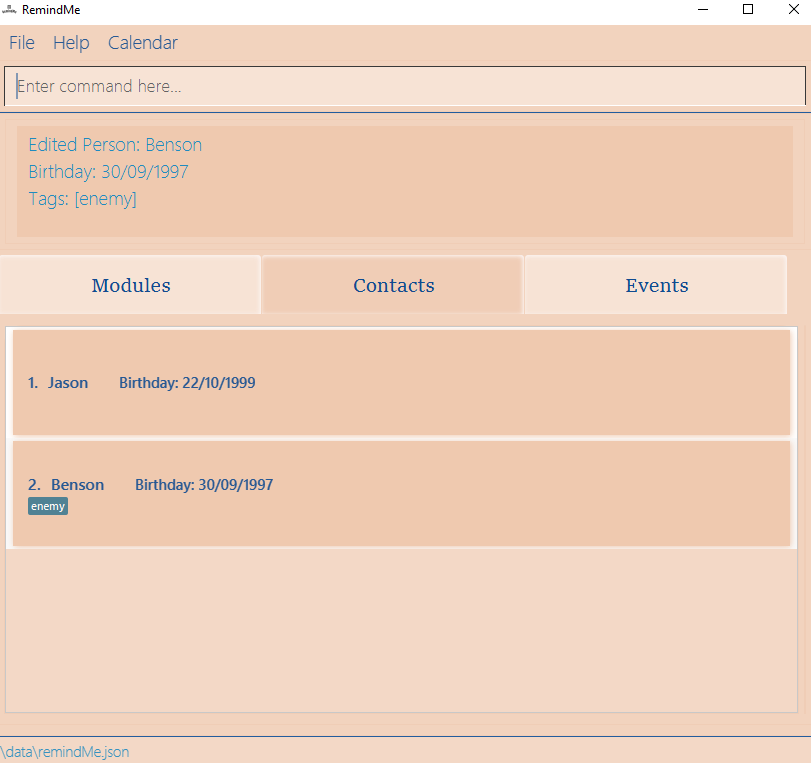
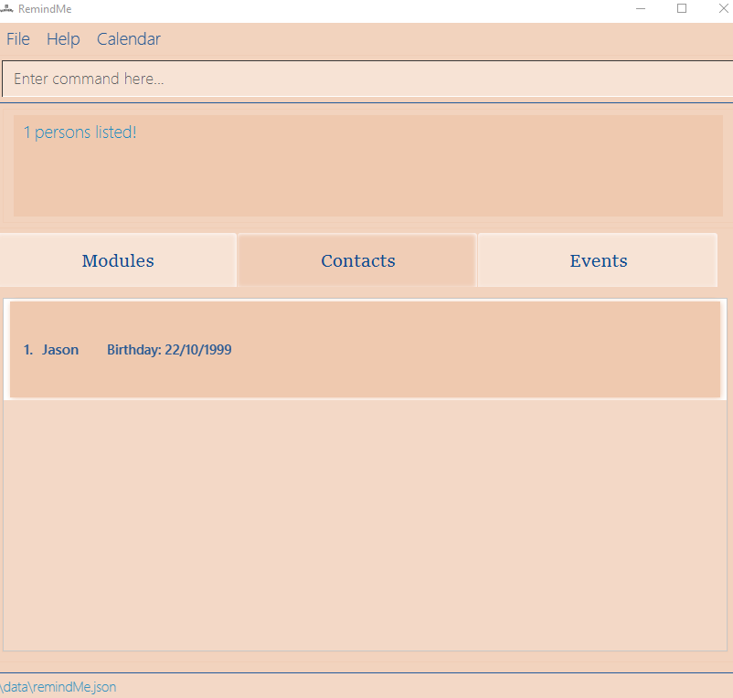
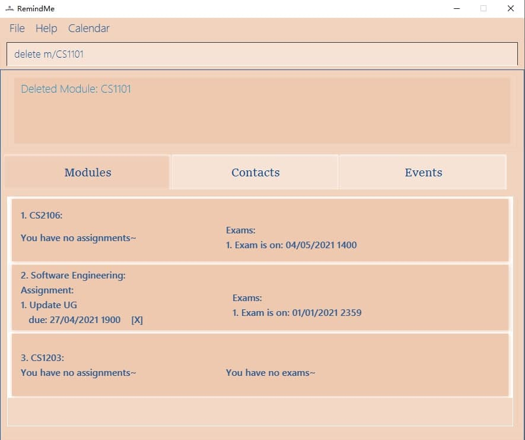
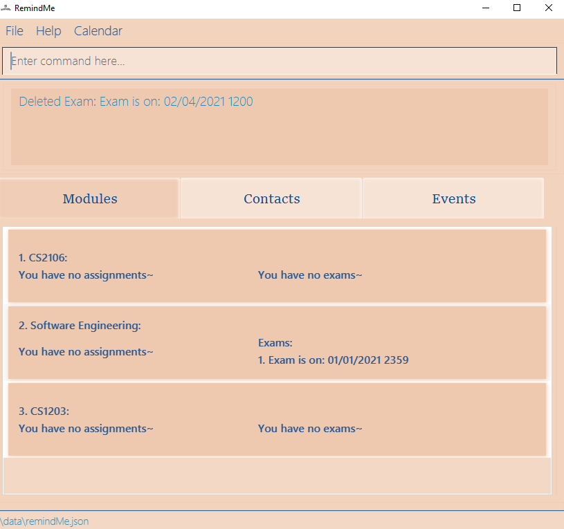
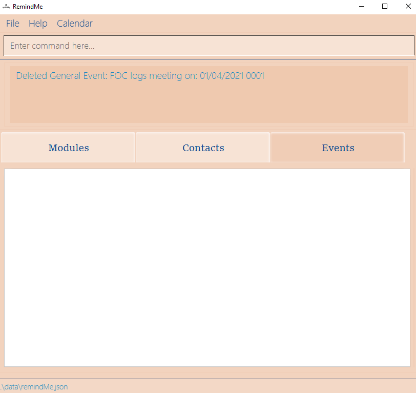

RemindMe User Guide v1.3
---
This user guide provides [start-up](#2-quick-start) instructions as well as detailed descriptions and usage of
all the [features](#3-features) in the RemindMe app. You can also access the product website via [link](https://ay2021s2-cs2103t-w15-1.github.io/tp/).

## Table of Contents

* **[1. Introduction](#1-introduction)**
* **[2. Quick Start](#2-quick-start)**
* **[3. Features](#3-features)**
    * **[3.1 Viewing Help : `help`](#31-viewing-help-help)**
    * **[3.2 Adding: `add`](#32-adding-add)**
      * [3.2.1 Adding a person](#321-adding-a-person)
      * [3.2.2 Adding a module](#322-adding-a-module)
      * [3.2.3 Adding an assignment](#323-adding-an-assignment)
      * [3.2.4 Adding an exam](#324-adding-an-exam)
      * [3.2.5 Adding a general event](#325-adding-a-general-event)
    * **[3.3 Editing: `edit`](#33-editing-edit)**
      * [3.3.1 Editing a person](#331-editing-a-person)
      * [3.3.2 Editing a module](#332-editing-a-module)
      * [3.3.3 Editing an assignment](#333-editing-an-assignment)
      * [3.3.4 Editing an exam](#334-editing-an-exam)
      * [3.3.5 Editing a general event](#335-editing-a-general-event)
    * **[3.4 Finding: `find`](#34-finding-find)**
      * [3.4.1 Finding persons](#341-finding-persons-n)
      * [3.4.2 Finding modules](#342-finding-modules-m)  
      * [3.4.3 Finding general events](#343-finding-general-events-g)
    * **[3.5 Marking as done `done`](#35-marking-as-done-done)**
    * **[3.6 Deleting: `delete`](#36-deleting-delete)**
      * [3.6.1 Deleting a person](#361-deleting-a-person)
      * [3.6.2 Deleting a module](#362-deleting-a-module)
      * [3.6.3 Deleting an assignment](#363-deleting-an-assignment)
      * [3.6.4 Deleting an exam](#364-deleting-an-exam)
      * [3.6.5 Deleting a general event](#365-deleting-a-general-event)  
    * **[3.7 Clearing: `clear`](#37-clearing-clear)**
      * [3.7.1 Clearing RemindMe](#371-clearing-remindme)
      * [3.7.2 Clearing all persons](#372-clearing-all-persons)
      * [3.7.3 Clearing all modules](#373-clearing-all-modules)
      * [3.7.4 Clearing all general events](#374-clearing-all-general-events)  
    * **[3.8 Viewing calendar: `calendar`](#38-viewing-calendar-calendar-c)**
    * **[3.9 Saving the data](#39-saving-the-data)**
    * **[3.10 Reminder window](#310-reminder-window)**
    * **[3.11 Exiting the program: `exit`](#311-exiting-the-program-exit-e)**
* **[FAQ](#4-faq)**
* **[Command summary](#5-command-summary)**

--------------------------------------------------------------------------------------------------------------------

## 1. Introduction
RemindMe aims to help students from the School of Computing(SOC) at the National University of Singapore(NUS). It helps 
manage school modules and events while keeping track of deadlines and friends' birthday. RemindMe provides a calendar 
view for events, allowing you to visualize and plan your schedules. RemindMe uses Command Line Interface(CLI) and 
Graphical User Interface(GUI), making it perfect for you if you like these attributes. If you can type fast, you will 
reap more benefits from RemindMe than traditional GUI scheduling apps. Let's get started with [Section 2](#2-quick-start)
and schedule towards a better work-life!

--------------------------------------------------------------------------------------------------------------------

## 2. Quick Start

1. Ensure you have Java `11` or above installed on your computer. You can download Java 11 via [link.](https://www.oracle.com/sg/java/technologies/javase-jdk11-downloads.html)
   * Set-up tutorial:
        * [Windows user](https://java.tutorials24x7.com/blog/how-to-install-java-11-on-windows)
        * [Mac user](https://docs.oracle.com/en/java/javase/11/install/installation-jdk-macos.html#GUID-2FE451B0-9572-4E38-A1A5-568B77B146DE)
        * [Linux user](https://docs.oracle.com/en/java/javase/11/install/installation-jdk-linux-platforms.html#GUID-737A84E4-2EFF-4D38-8E60-3E29D1B884B8)
 
 

2. Download the latest `remindMe.jar` from our [GitHub release page](https://github.com/AY2021S2-CS2103T-W15-1/tp/releases).
Copy the file to the folder you want to use as the home folder for your RemindMe.
Double click the file to start the app. 
 
 

3. Alternatively, you can use the command line to run RemindMe. 
   Open your command line by searching cmd in your desktop search bar.
Type in `java -jar RemindMe.jar` in the command box and press Enter to execute it.
The GUI similar to the below should appear in a few seconds. Note how the app contains some sample data. 
   
 
    

4. Press start to proceed to the main window.
   
 
          

5. Type the command in the command box and press enter on the keyboard to execute it.   
   Example: typing `help` and press enter will open the help window.
 
    

6. Some example commands you can try:
   * **`add m/CS2103`**: Adds a module name CS2103.
     
   * **`calendar`**: Displays the calendar with the tasks' deadlines and friends' birthdays.
     
   * **`exit`**: Exits the app.
 
    
   
7. Refer to [Section 3: Features](#3-features) for details of each command.
 
 

8. Use `clear` to remove the sample inputs and start adding your events!
 
 

--------------------------------------------------------------------------------------------------------------------

## 3. Features
The examples shown will be carried forward to the next features. You are welcomed to follow along and learn RemindMe with us!

**Notes about the command format:** 

* Words in `UPPER_CASE` are the parameters you supply. 
  Example: in `add m/MODULE`, `MODULE` is a parameter which can be used as `add m/CS2103`.

* Items in square brackets are optional. 
  Example: `add n/Name [t/TAG]` can be used as `add n/Alice t/friends` or as `add n/Alice`.
  

* Extraneous parameters for commands that do not take in parameters (such as `help` and `exit`) will be ignored. 
  Example: if the command specifies `help 123`, it will be interpreted as `help`.

### 3.1 Viewing Help: `help`

Shows the help page.

Format: `help`

### 3.2 Adding: `add`
This section shows features that deal with the adding of entries into your RemindMe.
 

**Note:** 

* Duplicate object is not allowed.
    * Example: Module with same name, assignment with same module, description and date time, etc. 

* The adding of an assignment/exam requires the related module to be added first.

 

#### 3.2.1 Adding a person
Add your friend with his/her birthday into RemindMe. 

Format: `add n/NAME b/BIRTHDAY [t/TAG]`

Example:
* `add n/Alice b/22/10/1999`
* `add n/Benson b/30/09/1997 t/friends`

Expected Result: 

#### 3.2.2 Adding a module
Add your module with its description.

Format: `add m/MODULE`

Example:
* `add m/CS1101`
* `add m/CS1203`

Result expected:
* `New module added: CS1101`
* `New module added: CS1203`

#### 3.2.3 Adding an assignment
Add an assignment under the module with the deadline provided.

Format: `add m/MODULE a/ASSIGNMENT by/dd/mm/yyyy HHmm`

Example:
* `add m/CS2101 a/Essay 1 by/01/01/2021 2359`

Result expected:
* `New assignment added: Essay 1 due: 01/01/2021 2359`

#### 3.2.4 Adding an exam
Add an exam under the module with the date time provided.

Format: `add m/MODULE e/dd/mm/yyyy HHmm`

Example:
* `add m/CS2101 e/01/01/2021 2359`
 
 

Final result for adding modules, assignments, and exams:
 
 

 
 

#### 3.2.5 Adding a general event
Add a general event with the description and date time provided.
    
Format: `add g/GENERALEVENT on/dd/mm/yyyy HHmm`

Example:
* `add g/School contest on/10/10/2021 1200`

Result expected:
 
 

 
 
### 3.3 Editing: `edit`
This section shows features that deal with the editing of entries in your RemindMe.

**Note:** 

* Editing of a person/module/event should not result in duplicates.
* The edited content must not be blank.

#### 3.3.1 Editing a person
Edit a person in RemindMe to change his/her name/birthday/tag.

Format: `edit INDEX [n/NEW NAME b/NEW BIRTHDAY [t/NEW TAG]]`

Examples:
* `edit 1 n/Jason`
* `edit 2 n/Benson b/30/09/1997`
* `edit 2 n/Benson t/enemy`

Results expected:
 
 

 
 

#### 3.3.2 Editing a module
Edit a module in the RemindMe app to change its title.

Format: `edit INDEX m/NEW MODULE TITLE`

Examples:
* `edit 1 m/CS2106`
* `edit 2 m/Software Engineering`

Results expected:
* `Module edited: CS2106`
* `Module edited: Software Engineering`

#### 3.3.3 Editing an assignment
Edit an assignment in the module in RemindMe to change its description or deadline.

Format: `edit m/MODULE a/ASSIGNMENT INDEX [d/NEW DESCRIPTION by/NEW DEADLINE]`

Examples:
* `edit m/Software Engineering a/1 d/Update UG`
* `edit m/Software Engineering a/1 by/27/04/2021 1900`

Result expected:
* `Assignment edited: Update UG due: 23/03/2021 2359`
* `Assignment edited: [X] Update UG due: 27/04/2021 1900`

#### 3.3.4 Editing an exam
Edit an exam in a module in the RemindMe app to change its date.

Format: `edit m/MODULE e/EXAM INDEX on/NEW DATE`

Examples:
* `edit m/CS2106 e/1 on/04/05/2021 1400`

Result expected:
* `Exam edited: Exam is on: 04/05/2021 1400`

Final result for editting module, assignments, and exams:
 
 

 
 

#### 3.3.5 Editing a general event
Edit a general event in the RemindMe app to change its date or description.

Format: `edit INDEX [g/NEW DESCRIPTION on/NEW DATE]`

Examples:
* `edit 1 g/FOC logs meeting`
* `edit 1 on/01/04/2021 0001`

Results expected:
* `Event edited: FOC logs meeting on: 10/06/2021 1630`
* `Event edited: FOC logs meeting on: 01/04/2021 0001`
 
 

 
 

### 3.4 Finding: `find`
This section shows features that deal with the locating of entries in the RemindMe app based on the prefix specified.

**Note:** 
* All find operations are case-insensitive
* Order of keywords used doesn't matter
* Only whole words are matched
* Entries matching at least one of the keywords will be returned.

#### 3.4.1 Finding persons: `n/`
Find person whose names contain any of the given keywords.  

**Note:** 
* Only the names are matched to the keywords

Format: `find n/KEYWORD [MORE KEYWORDS]`  

Example:
* `find n/alice`

Expected Result:
 
 

 
 
  
#### 3.4.2 Finding modules: `m/`
Find modules with titles containing any of the given keywords.

**Note:** 

* Only the module titles are matched to the keywords
    

    
Format: `find m/KEYWORD [MORE_KEYWORDS]`  

Examples: 
* `find m/CS1101`  

Expected Result:
 
 

 
 
  
#### 3.4.3 Finding general events: `g/`
Find general events with descriptions containing any of the given keywords.  

**Note:** 
* Only the descriptions of the general events are matched to the keywords
    

    

Format: `find g/KEYWORD [KEYWORDS]`  

Examples:
* `find g/FOC`  

Expected Result:
 
 

 
 

### 3.5 Marking as done: `done`
This section shows the feature that deals with marking an assignment as done. This feature only applies to assignments.
    
Format: `done m/MODULE a/INDEX`

Example:
*  `done m/Software Engineering a/1`

Expected Result:
 
 

 
 
  
### 3.6 Deleting: `delete`
This section show features that deals with the deleting of entries in the RemindMe app.

**Note:**
* Deleting any item from RemindME requires an item to be present at the given index.
    

     

#### 3.6.1 Deleting a person
Format: `delete INDEX`  

Examples:
* `delete 1`  

Expected Result:
 
 

 
 

#### 3.6.2 Deleting a module
Format: `delete m/MODULE`

Example:
* `delete m/Software Engineering`  

Expected Result:
 
 

 
 

#### 3.6.3 Deleting an assignment
Format: `delete m/MODULE a/INDEX`

Example:
* `add m/CS2106 a/Essay 1 by/28/03/2021 2359` 
  `delete m/CS2106 a/1`

Expected Result:
 
 

 
 

#### 3.6.4 Deleting an exam
Format: `delete m/MODULE e/INDEX`

Example: 
* `delete m/CS2106 e/1`

Expected Result:
 
 

 
 

#### 3.6.5 Deleting a general event
Format: `delete g/INDEX`

Example:
* `delete g/1`

Expected Result:
 
 

 
 

### 3.7 Clearing `clear`
This section show features that deals with the clearing of entries in the RemindMe app.  
 

:exclamation: **Caution:**
All cleared data cannot be recover.

 

#### 3.7.1 Clearing RemindMe  
Clears all entries in RemindMe.  
Format: `clear`

#### 3.7.2 Clearing all persons
Clears all contacts in RemindMe.  
Format: `clear [n/]`

#### 3.7.3 Clearing all modules
Clears all modules in RemindMe.  
Format: `clear [m/]`

#### 3.7.4 Clearing all general events
Clears all general events in RemindMe.
Format: `clear [g/]`

 

     If you follow along, your RemindMe should be empty. Now let's start using RemindMe to remind you!
 

### 3.8 Viewing calendar `calendar` `C`
There are 3 ways to check out the calendar.
 
1. you may type in `calendar` in the command box as shown below.
 
 

 
 

2. Alternatively, you may type shortcut `C` in the command box as shown below.

 
 

3. You may also click on the drop out calendar menu.
 
 

 
 

The calendar window as shown below will be displayed.
 
 

 
 
You may browse through the calendar over the months by clicking the 
left arrow button `<` and right arrow button `>` on the top right of the calendar window.
Additionally, you may click on `today` button to browse back to the month of current day's date.

### 3.9 Saving the data
Saving of data is automatic by the application whenever you 
update RemindMe.

### 3.10 Reminder window
Reminder will automatically pop up at the start of RemindMe.

 

### 3.11 Exiting the program `exit` `E`
There are 3 ways to exit the application. 
 
1. you may type in `exit` in the command box as shown below.

 
2. You may type in `E` in the command box as a shortcut as shown below.

 
3. Lastly, you may simply click the `X` button on the top right hand corner of the
application to exit the program.
   

## 4. FAQ

Q: Can I add assignment/exam first before the module? 
A: No, You need to add a module first.

Q: Can I add multiple modules with the same name?  
A: No, modules must have unique names to identify them.

Q: How do I clear away all my data?   
A: You can use the [`clear` command](#37-clearing-clear).

Q: When you close RemindMe main application, will other window close?  
A: Yes, do take note that if you close the main application, other windows will close as well

## 5. Command Summary  

Action | Description, Format 
--------|------------------ 
**add** |  `Add a person`   *`n/NAME b/BIRTHDAY [T/TAG]`*    `Add a module`   *`m/MODULE`*    `Add an assignment`   *`m/MODULE a/ASSIGNMENT by/dd/mm/yyyy HHmm`*    `Add an exam`   *`add m/MODULE e/dd/mm/yyyy HHmm`*    `Add an event`   *`g/GENERALEVENT on/dd/mm/yyyy HHmm`*   
**edit** | `Edit a person`   *`INDEX n/NEW NAME b/NEW BIRTHDAY T/NEW TAG`*    `Edit a module`   *`INDEX m/NEW MODULE TITLE`*    `Edit an assignment`    *`m/MODULE a/INDEX d/NEW DESCRIPTION by/NEW DEADLINE`*    `Edit an exam`   *`m/MODULE e/INDEX on/NEW DATE`*    `Edit an event`   *`INDEX g/NEW DESCRIPTION on/NEW DATE`*   
**find** | `Find persons`   *`n/KEYWORD [MORE KEYWORDS]`*    `Find modules`   *`m/KEYWORD [MORE KEYWORDS]`*    `Find general events`   *`g/KEYWORD [MORE KEYWORDS]`*   
**delete** | `Delete a person`   *`INDEX`*    `Delete a module`   *`m/MODULE`*    `Delete an assignment`   *`m/MODULE a/INDEX`*    `Delete an exam`   *`m/MODULE e/INDEX`*   `Delete an general event`   *`g/INDEX`*  
**Clear** | `Clear RemindMe`  *`clear`*   `Clear persons`   *`n/`*    `Clear module`   *`m/`*    `Clear general events`   *`g/`*
**See help page** | `help` 
**View Calendar** | `calendar` `C`
**Exit program** | `exit` `E` 

[Back to Table of Contents](#table-of-contents)
